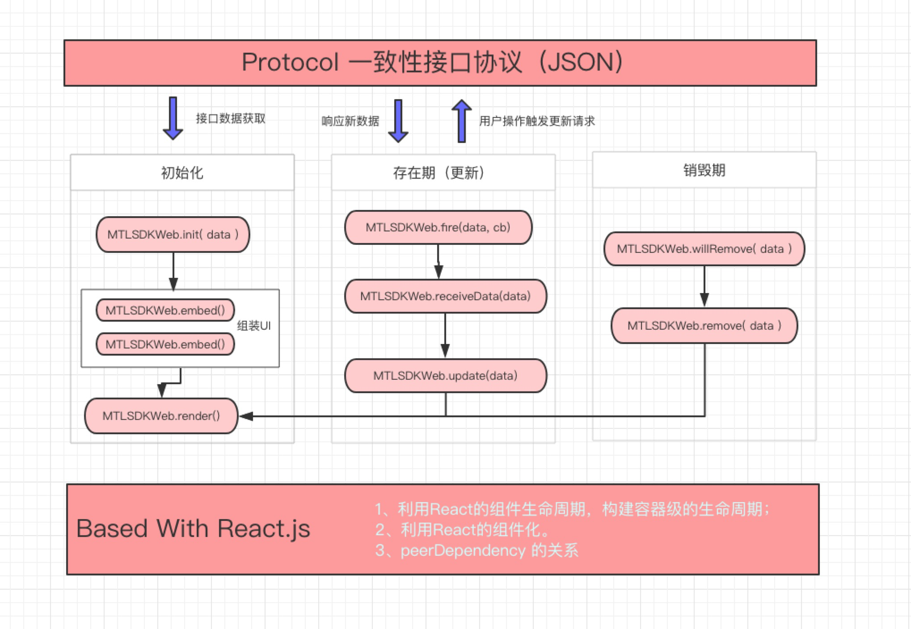

# 基于一致性协议的UI解析SDK

我们约定，基于一套框架性的接口协议来进行多端的渲染，这个 JSON 描述了端上结构、布局和数据，并通过统一的通信来实现端上的交互与数据的关联。



## Feature 特性和能力

- 自动解析数据，生成页面骨架
- 页面骨架全生命周期管理，通过几个简单 API 可实现对页面骨架的管理
- 通过元数据自动改变UI
- 支持自定义UI灵活插入页面骨架

## 如何使用

```
$ npm i mtl-sdk-web --save
```

代码引入
```
import React, { Component } from 'react'
import { render } from 'react-dom'
import axios from 'axios'

import MTLSDKWeb from 'mtl-sdk-web';
const JSONData = axios.get('./api/info');

export default class SDKWeb extends Component {
    render(){
        return (
            <MTLSDKWeb data={JSONData} />
        )
    }
}

```

## Docs

- 待完善

## How To Contribute

```
# 开发 SDK 
$ npm run build:dev
# 启动示例环境同步调试和验证
$ cd example && npm start

# 构建生成环境 SDK
$ npm run build:prod
```

## LICENSE

MIT

